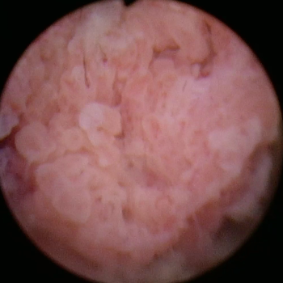
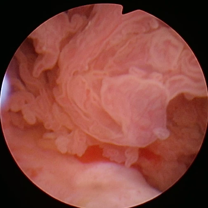
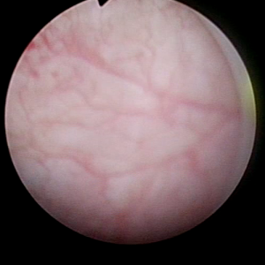
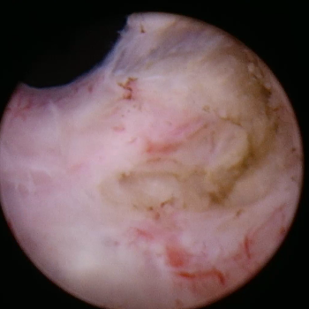
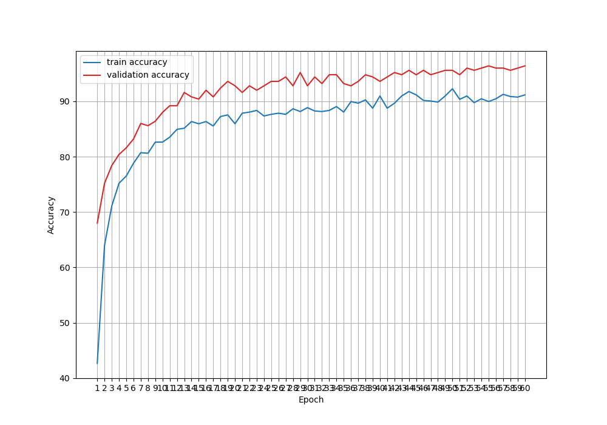
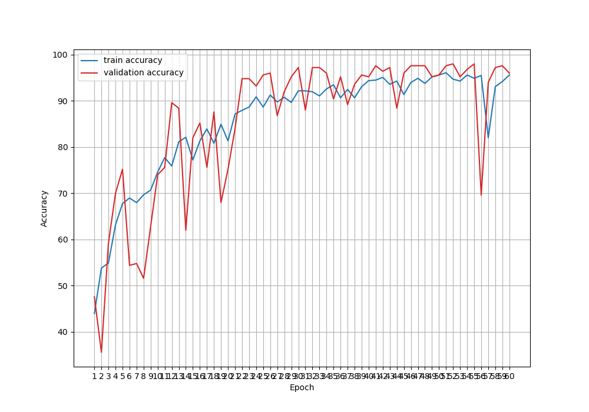

## Training DINOv2 for bladder cancer detection from cystoscopy images.

### Introduction
Bladder cancer is a common type of cancer that affects men and women. In the US, the estimated 
number of new cases for 2025 is 84,870 and the projected number of deaths is 
17,420 [1]. The diagnosis procedure starts with a cystoscopy; i.e., the 
insertion of a thin camera into the bladder to examine tissue. Abnormal 
tissue can be surgically extracted during the same procedure for histopathology 
analysis. 

In [2], the authors collect a dataset of cystoscopy images using a 
standard methodology known as 
White Light Imaging (WLI). The authors also collect images using 
Narrow Band Imaging (NBI), which is used
to examine potentially cancerous regions identified 
earlier using WLI. Because NBI is less common, the authors propose a Generative Adversarial 
Network (GAN) to expand the NBI dataset using images from the WLI 
dataset. After dataset expansion, a multi-modal method 
that uses both WLI and NBI images is used to classify images into 4 
different cancer-detection groups: 
- High Grade Cancer (HGC)
- Low Grade Cancer (LGC) 
- No Tumor Lesion (NTL)
- Non-Suspicious Tissue (NST)

In this repository, we include the code to build a DINOv2 classifier 
that predicts the same 4 classes using only the WLI images. The software 
enables two modes of training: transfer learning and fine tuning.
DINOv2 is a vision foundation model developed by Meta and 
released in April 2023 [3]. The code in this repository is a 
modified version of [4].

### Dataset
The WLI dataset of bladder cancer cystoscopy images 
consists of 1396 images distributed in groups for training (n=996), 
validation (n=250), and testing (n=150). Some images have a size of 350x350 pixels 
while others have a size of 300x300 pixels. The images are labeled according 
to one of the four classes mentioned above (HGC, LGC, NTL or NST).

The dataset can be downloaded from Zenodo:
https://zenodo.org/records/7741476

After downloading and unzipping the file, the data is stored in a 
root folder that has 4 subdirectories, one per class. The downloaded 
items also include an `annotations.csv` file that provides a list of 
images including the imaging modality, the class labels, and the 
assignment into train, validation, or testing. The tissue images below 
show examples of the collected images for the HGC, LGC, NTL, and NST 
categories respectively.

   
  
  
   

The script `do_cysto_partitions.py` is used to convert the original directory of 
images and annotations file to a data directory ready for training. A directory 
ready for training has TRN, VAL, and TST subdirectories, each containing  
N folders whose names are class labels. Each of these N folders stores the corresponding 
images. Use the `-h` option to see the arguments required to run the script.

### Dependencies

The `requirements.txt` file lists the external Python modules required to run the 
software. The version numbers indicate versions that were used during development 
and training. 

The `numpy` version was downgraded to 1.26.3 due to the following error: `TypeError: expected 
np.ndarray (got numpy.ndarray)`. The recommended solution is to downgrade numpy to any 
version lower than 1.26.4.

### Usage

#### Train a DINOv2 model using either fine-tuning or transfer-learning
Use `do_train.py` to train a DINOv2 model for image classification.
Use the `-h` 
option to find the required and optional arguments. The script needs the 
input data directory and generates results in an output directory. 

The code currently uses the pre-trained ViT-S/14 model available from Meta repositories. 
With 21 million parameters, this is the smallest model from the family. The model 
is pre-trained using ImageNet data. 

By default `do_train.py` will train the model using 
transfer learning, that is, we only train a final linear classification layer added 
to the model. However, the command-line flag`--fine_tune`enables training of all layers.

#### Evaluate a trained DINOv2 model using a test dataset
Use `do_eval.py` to perform inference on all images stored in a test 
directory (called TST). The `do_eval.py` script computes the loss and accuracy across the test 
data samples. Use the `-h` options to find required and optional arguments. The script 
needs the input directory of images (i.e., a directory with TRN, VAL, and TST 
subdirectories) and a stored trained model (i.e.,  a file with a `.pth` 
extension). The test accuracy and loss values are displayed on screen.

### Results
The figures below show the accuracy learning curves when a model is 
trained using a learning rate of 1E-4, batch size of 32, for 60 epochs. 
The first figure shows the use of transfer learning, while 
the second figure shows the use of fine-tuning. Notice that 
in both cases, the validation accuracy can reach and exceed 95%. 

   
  

An evaluation of the trained models using the test dataset returns test 
accuracies significantly lower than those obtained for the validation dataset. Because, 
the validation dataset is never used in this example for adjusting weights, computing gradients, 
or selecting hyperparameters, the difference of results is an indication that there is 
some condition in the test data that makes classification more difficult. 

When this condition is observed, a better approach to generate performance 
results is to combine train, validation, and test datasets into a single collection, 
and then use either K-fold partitioning to train K models or Monte Carlo cross-validation 
to train K models. These methods provide the average performance over K trials 
regardless of selection of a validation/test dataset.  These methods also provide 
confidence intervals for the average performance estimates. We have not performed 
this type of experiments yet. 

### References

[1] National Cancer Institute, Cancer Stat Facts: Bladder Cancer, Surveillance, 
Epidemiology, and End Results (SEER) Program, on-line publication, 
last accessed on August 24, 2025.
https://seer.cancer.gov/statfacts/html/urinb.html

[2] J. Lazo, B. Rosa, M. Catellani, M. Fontana, F. A. Mistretta, G. Musi, 
O. de Cobelli, M. de Mathelin, E. De Momi, Semi-Supervised Bladder 
Tissue Classification in Multi-Domain Endoscopic Images, 
IEEE Trans. Biomedical Engineering, 70 (10), 2023.

[3] M. Oquab et al., "DINOv2: Learning Robust Visual 
Features without Supervision", arXiv:2304.07193

[4] Sovit Ranjan Rath, "DINOv2 for Image Classification: Fine-Tuning
vs Transfer Learning", online publication, 2025.
https://debuggercafe.com/dinov2-for-image-classification-fine-tuning-vs-transfer-learning/
